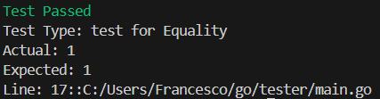

# Tester
A beutiful and easy way to test go packages directly into your code! This tool offers the possibility of writing tests directly into your code instead of having to write a new file.

## Objective
This is not intended to be a professional testing tool, it has been developed by a very bored 17 years old self-thought developer pissed at test files. I raccomend using [testify]("https://github.com/stretchr/testify") as a testing tool (as i do in this very repo) but i yet think that this can be an interesting project to contribute to. 

The aim is to print to the screen the result of various tests and the informations annexed to it by writing the test itself inside of the main code instead of having to write that to another file.

---
## Installation

inside of your go module get the code using 
```go 
go get github.com/serangelicloud/tester
 ```
and then import it into your code
```go 
import "github.com/serangelicloud/tester"
```
## Usage
### Enabling tests
First of all at the beginning of your code set `RunTests` as true 
```go
tester.RunTests = true
```
This will enamble the test execution in your code and communicate to the testing file that it can run tests

### showing output
The package on default doesn't show any output when tests are ran unless they fail. To show concise output set `tester.ShowOutput` as true. This will print test passed for any test that is passed and it will print test failed for any failed test alongside the test details in order to identify it.

To show details about passed tests too set `tester.ShowDetailedPassed` as true.

### Writing a test
### Running a Test

| Test Function | Function Signature | Description | Example |
|---------------|---------------------|-------------|---------|
| `TestEqual` | `TestEqual(actual interface{}, expected interface{}, request string) bool` | Test whether two values are equal. | `result := tester.TestEqual(1, 1, "Testing if two integers are equal")` |
| `TestDifferent` | `TestDifferent(actual interface{}, expected interface{}, request string) bool` | Test whether two values are different. | `result := tester.TestDifferent(1, 2, "Testing if two integers are different")` |
| `TestNil` | `TestNil(actual interface{}, request string) bool` | Test whether a value is nil. | `result := tester.TestNil(nil, "Testing if a value is nil")` |
| `TestNotNil` | `TestNotNil(actual interface{}, request string) bool` | Test whether a value is not nil. | `result := tester.TestNotNil(1, "Testing if a value is not nil")` |
| `TestCheckReturnType` | `TestCheckReturnType(actual interface{}, expected interface{}, request string) bool` | Test whether the return type of a value matches the expected type. | `result := tester.TestCheckReturnType(1, "int", "Testing if the return type is 'int'")` |

### output
All this tests will produce an output like this



**Test Type:** Indicates the type of test performed. This value is predefined within each test function and describes the nature of the comparison being made (e.g., equality, inequality, nil check, type assertion).

**Actual:** Displays the actual value received by the test function during execution. This value represents the result of the operation or comparison being tested.

**Expected:** Represents the expected value that the test was intended to match or verify. It serves as a reference point for evaluating the correctness of the operation.

**Line:** Specifies the line number and path within the source code where the test function was called. This information aids in identifying the exact location of the test within the codebase.

### printing final test results
To print the number of failed and passed tests in your main file write 
```go
    tester.PrintExecutedTests()
```